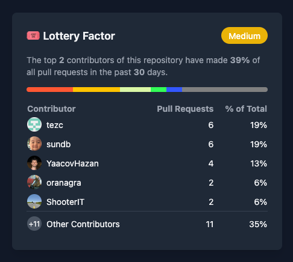

# GitHub Lottery Factor

A tool to measure knowledge concentration risk in GitHub repositories by
analyzing pull request contribution patterns.



## Quick Start

```bash
# Install dependencies
gem install graphql-client sqlite3

# Set your GitHub token
export GITHUB_TOKEN=your_github_token_here

# Run the analysis
ruby build.rb --repo redis/redis --database repo.db --time-range 30
```

## Understanding Results

The report shows what percentage of pull requests come from your top
contributors. A high concentration (>50%) indicates knowledge silos and
potential risk. Lower percentages suggest more distributed knowledge across the
team.
